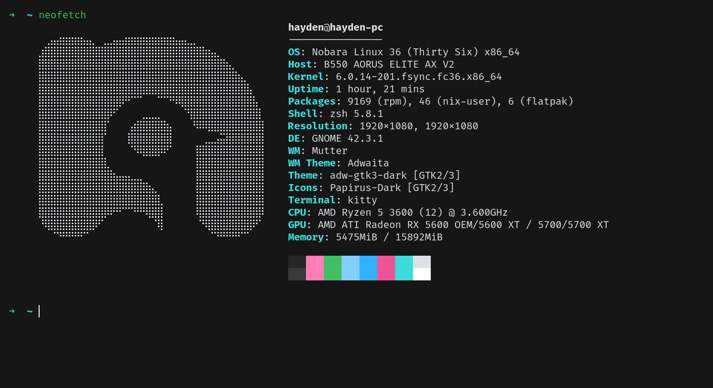

# kitty
Oxocarbon port for the kitty terminal

## About this port
This is a port of the [Oxocarbon](https://github.com/nyoom-engineering/oxocarbon) colorscheme made by [Nyoom Engineering](https://github.com/nyoom-engineering) to the [kitty](https://github.com/kovidgoyal/kitty) terminal, the original ports were made by [Boyd Kelly](https://gitlab.com/boydkelly) and [hbjydev](https://github.com/hbjydev).

## How to use
Copy the contents of the theme into your [kitty.conf](https://sw.kovidgoyal.net/kitty/conf/).

## Credits
Thanks to [Shaunsingh](https://github.com/shaunsingh) for the original theme implementation in Neovim as well as base16.

Credits to [Boyd Kelly](https://gitlab.com/boydkelly) for the [light theme](https://gitlab.com/boydkelly/carbonizer/-/blob/main/kitty/oxocarbon-light.conf) port.

And credits to [hbjydev](https://github.com/hbjydev) for the [dark theme](https://github.com/hbjydev/oxocarbon-kitty) port as well as the preview image.

